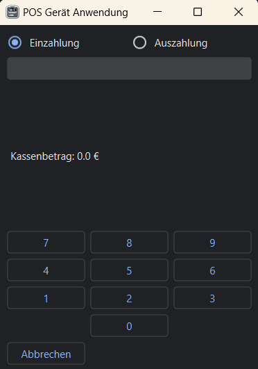

# POS Device Application (POS Gerät Anwendung)

## Overview

The POS Device Application is a PyQt6-based graphical user interface designed for facilitating transactions in a retail environment. This application supports basic cash register functions, including adding and removing funds, and provides an intuitive interface for managing transactions. It logs all activities and can communicate with a printer for receipt printing.



## Features

- **Transaction Management**: Handle deposits (Einzahlung) and withdrawals (Auszahlung) with ease.
- **Real-Time Cash Register Balance**: View the current cash register balance in real-time.
- **Transaction Logging**: All transactions are logged for future reference.
- **Receipt Printing**: Directly print transaction receipts to a configured printer.
- **Multilingual Support**: Interface available in German (default).

## Installation

```bash
pip install -r requirements.txt
```

### Setup

1. Clone the repository:

```bash
git clone https://github.com/Lightfield0/POS-Device-Application.git
```

## Usage

Upon launching the POS Device Application, you are greeted with a simple and intuitive interface. Choose between Einzahlung (deposit) or Auszahlung (withdrawal), enter the amount, and press Enter to confirm. The current balance is displayed at all times, and transactions can be printed or logged with a single click.

## Configuration

- **Printer Setup**: To enable receipt printing, ensure your printer is networked and update the `printer_ip` and `printer_port` variables in the `print_to_printer` method accordingly.

## Contributing

Contributions to the POS Device Application are welcome! Please feel free to report any issues or submit pull requests.

## License

This project is licensed under the MIT License - see the [LICENSE.md](LICENSE.md) file for details.
